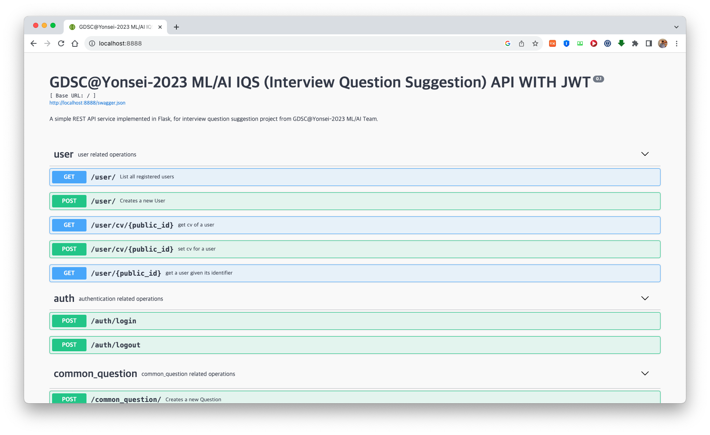

# GDSC@Yonsei-2023 ML/AI IQS (Interview Question Suggestion) API

## Description

A simple REST API server implemented in Flask, for interview question suggestion project from GDSC@Yonsei-2023 ML/AI Team.


## Pre-requisite
Docker

## Usage
```
docker run -d -p 0.0.0.0:8888:8888/tcp ga06033/gdsc-yonsei:build_0.1
```
The server uses 8888 port.


## Contact
Yewon Lim - ga06033@yonsei.ac.kr
